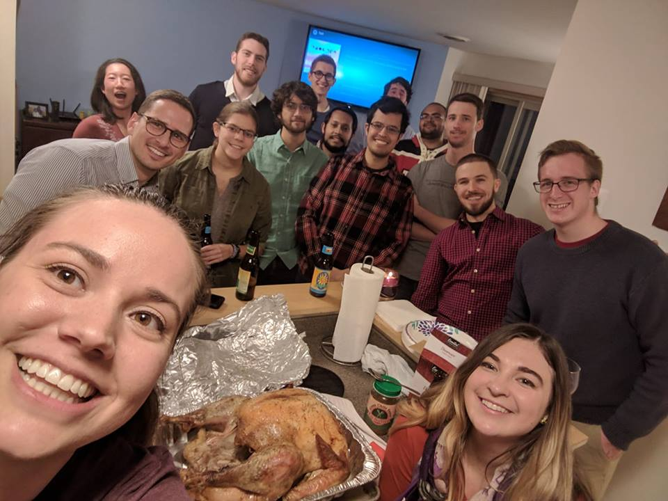
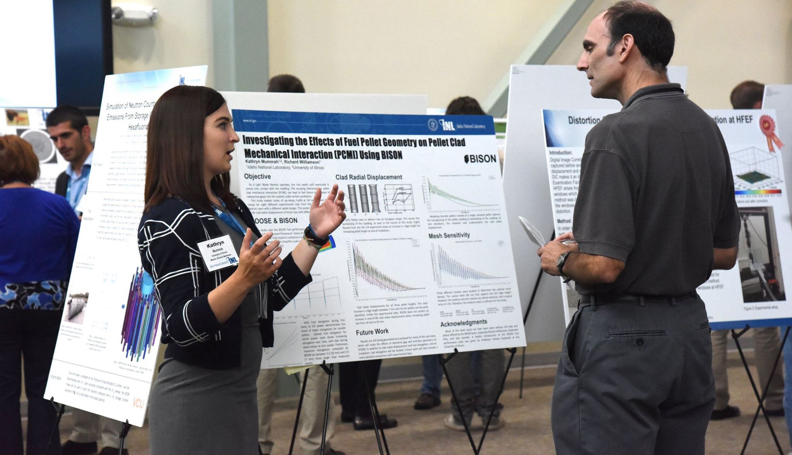
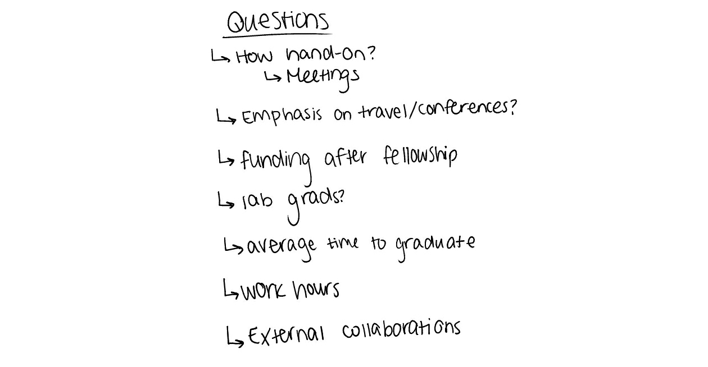
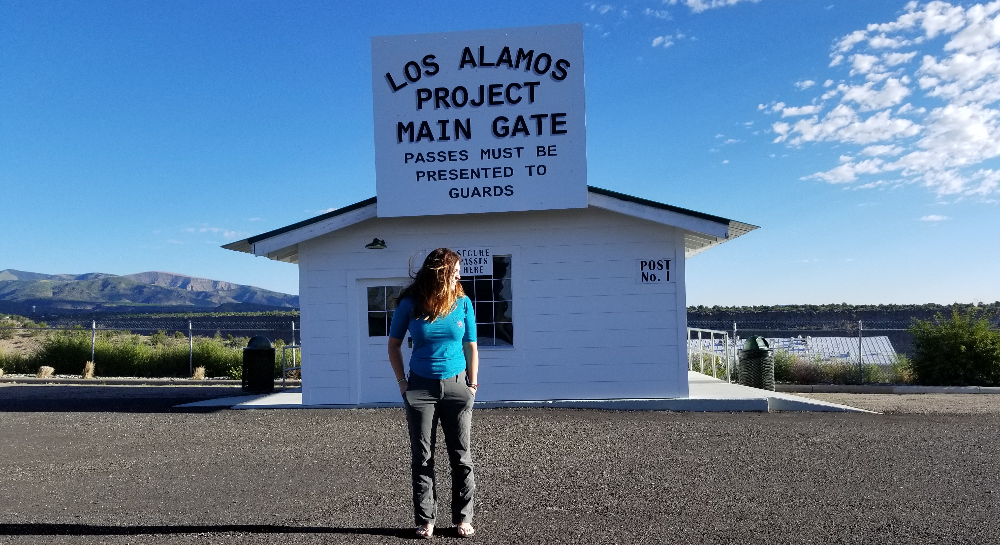
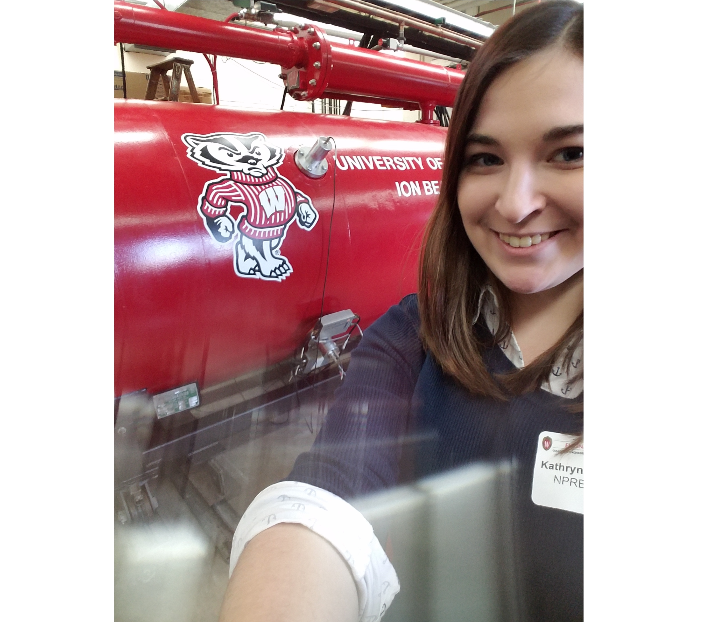
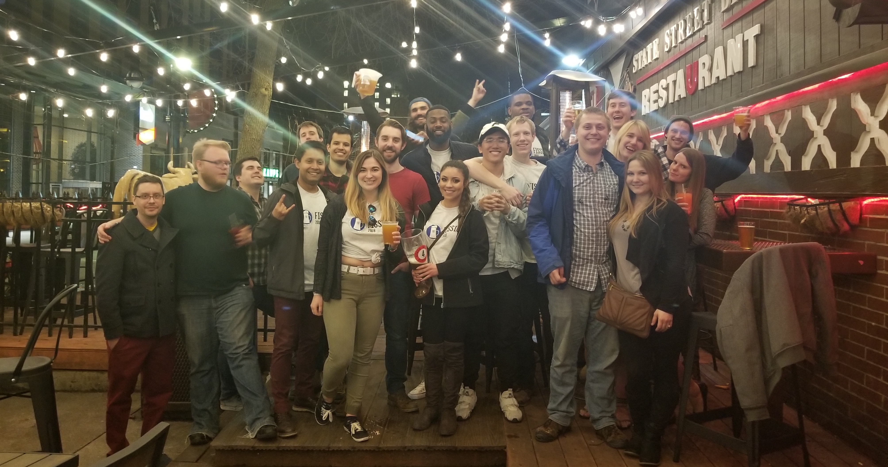
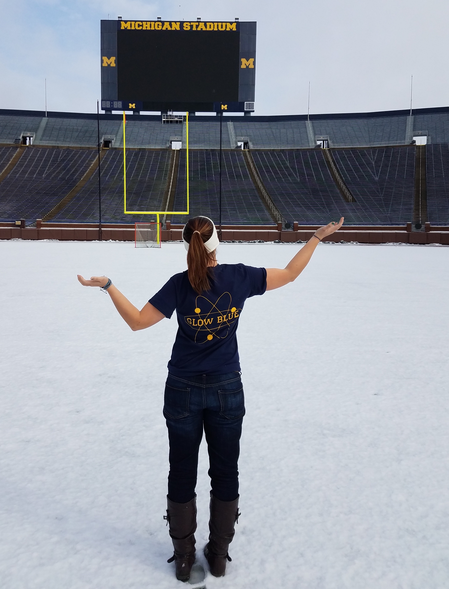
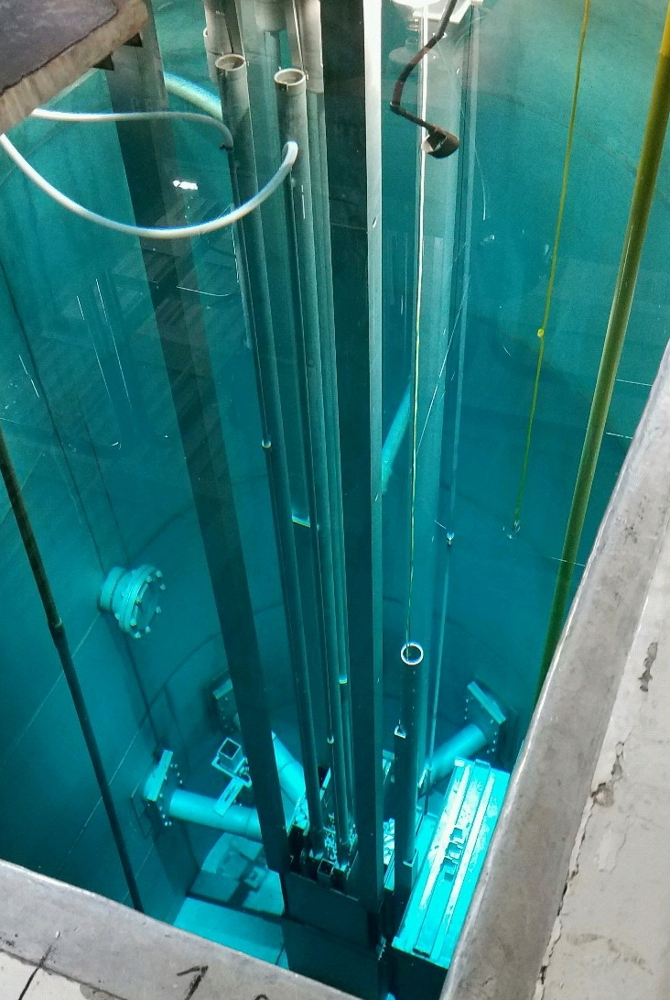

Attending university visit weekends as a potential graduate student was one of the most eye-opening things I've ever done as a student. I learned a lot about myself, gained vital information in the search towards the best graduate experience, and made some fantastic friends along the way. Since February is wrapping up, it's about time for 2019 university visit weekends. Here are my tips for any student looking to ace their visit and find the right grad school fit for them.

I went through the visit weekend process in 2017, when I was finishing my BS in [Nuclear, Plasma, and Radiological Engineering](https://npre.illinois.edu) at the [University of Illinois at Urbana-Champaign](https://illinois.edu) (a mouthful, I know). Now in my second year of [grad school](https://www.engr.wisc.edu/department/engineering-physics/) at the [University of Wisconsin-Madison](https://www.wisc.edu), I can reflect back on my own experience, and give a bit more insight I've gained over the last 2 years. I'm a nuclear engineer, but my tips are aimed at the broader STEM community. I won't give tips specific to any particular field, so hopefully prospective grad students in many disciplines can gain some useful information!

# 1. Prioritize what matters to you before you go

Your grad school visits are going to be vastly different than any prospective undergraduate visits you participated in as a high schooler. This reflects the change in priorities between (typically) a 17- or 18-year old who might not have a major picked out versus a someone with a bachelors (or almost there!) looking to develop their research skills to earn a MS or PhD.

So let's break down the priorities for prospective grad students. This isn't a hard and fast list, and your priorities might be in a different order! But here is the way I approached ranking the factors in choosing a university:

1. Research advisor/PI
2. Research group and departmental community
3. Research project
4. Location & university

#### Research advisor

While many students believe they should prioritize the work they want to do as the most important factor in choosing a school (that's the whole point of grad school, right?), I'm going to tell you otherwise. Your research is **not** going to be the biggest factor in whether or not you have a good grad school experience.

Depending on the degree and field you're pursuing, you're committing to somewhere between 2 and 7+ years towards the process of earning a graduate degree. Throughout this whole process, one person typically has overwhelming control over your work, your time, and when you get to graduate-- your [advisor/PI](http://www.inquiriesjournal.com/blog/posts/243/selecting-graduate-research-advisor/).

When I talk to my friends and colleagues about their lives as graduate students, they constantly point to their advisor as the source of their emotions-- both good and bad! Your research may change, the grant you're funded on may expire, you may change your career goals, but through it all, your advisor will be there.

Because of this, I argue that the professor you choose to work for is the most important aspect of choosing your grad school. In practicality, funding and personal factors (such as a spouse or a need to remain near family) may interfere with choosing the "absolute" best faculty advisor, but in general I recommend students choose a fantastic advisor even over the most interesting research project. This isn't to say that you should take a 90 degree turn on your research interests to follow an advisor, but within a general field of study (for me, it would be "the nuclear fuel cycle"), follow the advisor first.

 <small>From the [American Economic Association](https://www.aeaweb.org/content/file?id=992)</small>

Another essential factor to consider is funding associated with your potential advisor. This can be highly field-dependent, but you should seek to gain as much understanding of your potential future funding situation as possible. In STEM fields, a funding offer that covers your tuition and provides a small stipend is common, but not universal. Often this suport comes in the form of a [teaching or research assistantship](http://statistics-help-for-students.com/Teaching-Assistantship-or-Research-Assistantship.htm#.XHbh_GbMzOQ).

Can your professor guarantee 5(+) years of a research assistantship (RA)? Will you be a teaching assistant (TA), and if so, will it only be for a year or will you have to teach for several (or all) years? If you get put on a grant or fellowship that doesn't cover the length of your program, what would happen after it expires? These questions are all directly relevant to your financial security in the next half-decade, so keep that in mind as you meet with faculty.

#### Community

<small>Friendsgiving with grad students in my department</small>

One step removed from your faculty advisor is the research group and larger departmental community. Here's where I'm going to be brutally honest: making friends can be much harder in graduate school than undergrad. I can't speak for everyone, but many graduate students develop their closest friends from the students in their group and department.

If you visit a school and notice that the current grad students don't seem friendly together, it could be a red flag. Having a supportive community around you is an extremely valuable if not necessary aspect of being a successful graduate student, and if it doesn't appear that you'll find that community at the department you're visiting, you should make a note.

If you feel strongly about being involved in an organization or service group, it is worth searching if they have a chapter or similar organization nearby! This can also provide the community you'll want to build around you.

#### Research project

This one is pretty self explanatory! You're going to graduate school (at least in part) to develop research skills and become an expert in a highly specific field. You should be able to envision pursuing the ***type*** of work that your chosen advisor and research group does for years, even if the exact project changes. Faculty may not know exactly what project you would work on, but you should be able to get a good understanding of the methods and type of questions your potential research group pursues.

I won't beat everyone over the head about this factor, because I know that you're already thinking about the research that sounds interesting to you.

#### Location and university

<small>I took a free hour to explore the University of Wisconsin campus during my visit weekend in 2017</small>

I wouldn't personally choose a school in a nice location over a school in a less desirable location but with a fantastic PI. But I would be lying if I said location and university deserves to play no role in your final decision. You're committing to years in a new and potentially unfamiliar location!

Try to get a sense of the weather when you're visiting. A day or two in February-March-April won't give you a full understanding of the climate though, so as simple as it is, I recommend checking out [U.S. climate data](https://www.usclimatedata.com) and asking current graduate students about the weather year-round.

Many grad school visits **don't** have the time to take you on a campus walking or driving tour. If you have a free moment (for example, in between meeting with faculty), I would recommend taking a walk around campus. Ask one of the students you've met to recommend a path or a place to visit!

#### Plan out your priorities before you arrive!

While I listed the four areas I focused most heavily on when I made my grad school decision, yours might be different. The important thing is to think about which areas are most important to you *before* you get wrapped up in the busy schedule of visiting a new place. If you already know which factors matter most to you, you can focus on the visit itself when the time comes.

# 2. Take notes, and take notes of your notes

 <small>Handwritten notes from [123RF](http://123rf.com)</small>

Visit weekends can be 48 hours or less on the ground. In that short time, you're introduced to a new university, department, faculty, cohort of grad students, other prospective students, and degree and funding options. While it may feel like you're absorbing everything, it will all blur together not long after you leave. Especially if you're visiting more than one university, it may be hard to keep everything straight.

It seems like such a simple recommendation, but I didn't take good notes on my visits and I think that was one of my biggest mistakes. Document everything! Especially how you feel and any direct recommendations such as "don't live on the west side of campus".

# 3. Ask these questions to the faculty you meet

<small>These are the actual notes I prepared before going on grad school visits. I asked every one of these questions in one way or another.</small>

Your schedule will likely include one-on-one meetings with several faculty you're interested in. This is your opportunity to learn more about their work and how their group operates. Be ready to talk about your own interests and goals too; this interview works both ways. You should research each faculty member you're going to meet with beforehand so you're not asking questions like "so... what does your group do?".

You should get of a sense of how your potential future research group operates. Does the group have weekly meetings? Does the professor meet one-on-one with each student weekly, or by request? What is the average time to graduation? Is there a lot of collaboration, or are most students working independently of each other? All of these questions will help you understand the culture of the research group.

I mentioned work-life balance in tip #1 as an issue your research advisor has a ton of control over. I recommend asking each faculty member you meet about their work-life balance philosophy for graduate students. Recent research suggests that graduate students experience [much higher rates of depression and anxiety](https://www.insidehighered.com/news/2018/03/06/new-study-says-graduate-students-mental-health-crisis) than the general population, and good work-life balance was shown to be “significantly correlated with better mental health outcomes."

Since your advisor is so crucial in your future work-life balance, you should ask them what their expectations are. Do they expect their students to work nights and weekends? How much should students prioritize research versus classes in their first few years when you'll be taking several classes a semester? Will you be expected to hold certain hours (i.e. 8 am - 6 pm weekdays) or is it more flexible?

If you're interested in external collaborations or internships, ask! See if any students in the group have recently participated in internships or worked with an external collaborator. I brought up this possiblity to every potential advisor I talked to and prioritized one that was willing to let me build a collaboration with a national lab. This paid off and I had the chance to go to [Los Alamos National Lab](https://www.lanl.gov) last summer, which set up the research I'm doing now.

I also recommend asking about conferences and publications. Does the professor regularly send their students to present their work at conferences? Do they have a fixed number of publications they require their students to have accepted by journals before they can graduate?

Plan out your list of questions beforehand. You don't necessarily know how long you'll get to meet with each faculty member beforehand, and it varies from school to school. If a schedule gets sent to you beforehand, be sure to check it and plan ahead! If you already know what questions you want to ask and which ones are most important, you can get a ton of value out of a meeting, whether its 15 minutes or 60.

# 4. Be prepared and professional

<!---  --->

You're balancing professionalism with practicality on your visit, and I recommend you keep those in mind when you decide what to wear. Some visits may have official dress codes, but others may not. You should wear what you feel comfortable in, but err on the side of more professional. You shouldn't need to wear a full suit and tie unless the program recommends it, but I do suggest smart casual or business casual, with some examples below.

 <small>Business casual examples, all taken from Pinterest</small>

Don't forget the basics like folder, pen, and extra paper! You'll probably be given a folder of information and maybe a drawstring back to hold it all, but prepare as if you won't.

You also need to account for the fact that you may be walking between meetings with different faculty on a short timeframe. If you're going to take heels I would recommend bringing flats or other comfortable shoes to switch into if you're in a pinch. Even if you're not going on a campus tour, you might have to walk outside for some amount of time so be prepared for rain/snow as well (depending on the location).

        

            
            <small>   I wore a dress shirt and sweater to this visit</small>
        

        

            
            <small>     A dress shirt/dress and blazer is a good combination too</small>
        

# 5. Talk to current students, and press for the raw truth

You'll have time to talk directly with current graduate students in the program. This time is gold! Try to meet with students in the groups you're interested in **AND** students who aren't. You'll often get different perspectives between the two. For example, some students might downplay how difficult their research group culture is, where another student in the program might be more forthcoming with information about research groups.

Ask some of the same questions you asked the faculty: what is the work-life balance expectation? How often do you get sent to conferences? Is the professor hands-on or hands-off? Do students graduate in a timely manner?

I recommend attending optional dinner or after-dinner events, which may be a formal part of the program or an informal opportunities set up by current grad students. A casual setting removed from campus buildings may encourage them to be more forthcoming.

 <small>This picture was taken at the same sports bar that the Engineering Physics department at UW-Madison takes prospective students to, although this wasn't taken during visit weekend.</small>

This is also a great time to ask about other non-university matters. Where do most students live? What fun things do people do around town? Does everyone have a car or can you get around without one? Current grad students are your ticket to a deeper understanding of the city/town you're considering moving to!

# 6. Interact with your fellow prospective students, and jot down their contact info!

Grad school visits can feel like an all-out sprint to absorb as much information about a university, department, advisor, research group, and degree program as possible (I'm stressed just writing those all down). In some ways, it is. Choosing a graduate school is a deeply personal choice, but remember that you're not the only one going through it.

If you're on an official visit weekend sponsored by the university or department you applied to, you're likely surrounded by others going through the same process as you. In between one-on-ones with faculty and presentations by the department, take the time to get to know your fellow prospective students.

The students you're with will become your peers and sometimes even your closest friends. Many people find their future roommates at visit weekend.

But even if you don't end up at the same university as your peers at visit weekend, you'll emerge with a network of similarly-aged students pursuing the same degree as you.

I have several good friends that I met at visit weekends and though we didn't choose the same university,  I can even boast further new friends (and a mud volleyball tournament championship!) that propagated from staying in touch with a student I met on a University of Michigan visit.

I have no doubt I'd have more good friends at other schools if I had only remembered to get their contact information! In today's day and age, it's easy to reach out to someone-- if you remember their full name! In the whirlwind 48 hours I spent at each school, I often forgot to write down full names and didn't ask for emails or phone numbers (or facebook, snapchat, twitter, instagram etc etc). Don't make the same mistake I did; it's always better to grab contact info even if you don't end up messaging them later.

Once you've decided on a school, reach back out to the other students from that visit! If you stay in touch, you can start the next fall with a few friends already.

---

With these tips in mind, you're ready to get the best out of visit weekend! I wish you all the best of luck in finding your future grad school home!

## Bonus: a few extra tips to keep in mind

<small>Downtown Knoxville during a visit to the University of Tennessee</small>

Consider sending a thank you to the organizers of the visit weekend, which typically includes someone in the department administration, the department graduate coordinator, and potentially a grad student volunteer. Also sent a follow-up and [thank you](https://www.gradschools.com/get-informed/applying-graduate-school/essay-writing/grad-school-interview-thank-you-letter) to each of the faculty you spoke to. Be courteous, but also be honest. Don't express your wholehearted desire to accept an offer if you're not yet ready to do so or you don't plan to.

I recommend waiting to accept a professor's official or unofficial offer until you've completed your last visit, even if you've made your final decision. If you get a funding offer from a school/advisor you don't intend to accept, make sure to graciously decline in a timely manner so they can reach out to other candidates.

Finally, have fun! Don't forget to take some pictures and make some friends! Grad school visits can be stressful, but they are also tons of fun! Relax, take a deep breath, remember to record everything, and get ready to find your future graduate school!

        

            
            <small>Visiting Michigan Stadium</small>
        

        

            
            <small>University research reactor from lab tours </small>
        

<meta name="twitter:card" content="summary" />
<meta name="twitter:site" content="@nuclearkatie" />
<meta name="twitter:title" content="Going on grad school visits soon? Follow these 6 tips to get the most out of your visit" />
<meta name="twitter:description" content="Attending university visit weekends as a potential graduate student was one of the most eye-opening things I've ever done as a student. I learned a lot about myself, gained vital information in the search towards the best graduate experience, and made some fantastic friends along the way. Since February is wrapping up, it's about time for 2019 university visit weekends. Here are my tips for any student looking to ace their visit and find the right grad school fit for them." />
<meta name="twitter:image" content="https://nuclearkatie.github.io/assets/images/posts/2019/university-cover.png" />
