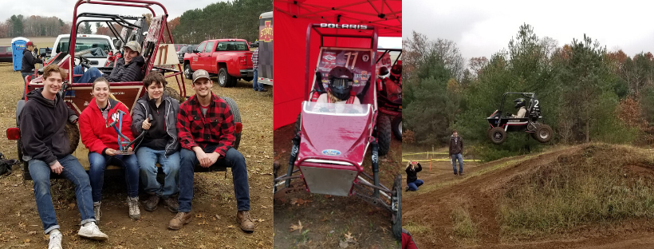

Despite my aura of radioactivity, I'm not *all* nuclear all the
time! I do other stuff too! Here are some of the ways I spend my free time...

# Dogs

## Fetch

I foster and dog-sit rescue dogs with
[Fetch Wisconsin Rescue](http://fetchwi.org).

#### Jolene (Oct 2019)

Jolene is a hound mix (part beagle maybe?) and is 35 pounds of cuddle-bug. She
was picked up as a stray in Texas and saved less than an hour before she was
scheduled to be euthanized :(

She loves couches, hates cars, and her puppy-dog eyes are extremely dangerous.
Good girl Jolene!

#### Monica (2019)

My first foster dog, Monica, has been adopted! She is a three year old (at the
  time I had her) lab mix with separation anxiety but a huge heart.

#### Dog sitting

While I usually foster dogs until they find their furever home, sometimes I
dog-sit for shorter periods of time, usually when a foster is out of town.

## Sled Dogs

I'm a volunteer dog handler at sled dog races! I have no plans to race dogs
myself, but I love to support the athletes (dog and human alike)! Look for me at
many of the races in the upper midwest this winter!

If you're interested in learning more about doggo-powered sports or just want to
see some cool dogs pics, consider following musher
[Blair Braverman](https://twitter.com/BlairBraverman?ref_src=twsrc%5Egoogle%7Ctwcamp%5Eserp%7Ctwgr%5Eauthor)
! It was her tweets and her book, [Welcome to the Goddamn Ice Cube](https://www.harpercollins.com/9780062311580/welcome-to-the-goddamn-ice-cube/)
that got me into the sport!

## Baja SAE

This is my second year on the UW-Madison [Baja SAE](https://www.bajasae.net/)
automotive team. I'm never going to be a competition driver, but I have a lot of
fun anyway!

# The rest of the page is under construction

### Blacksmithing

### Volleyball

## Generally doing outdoorsy things
