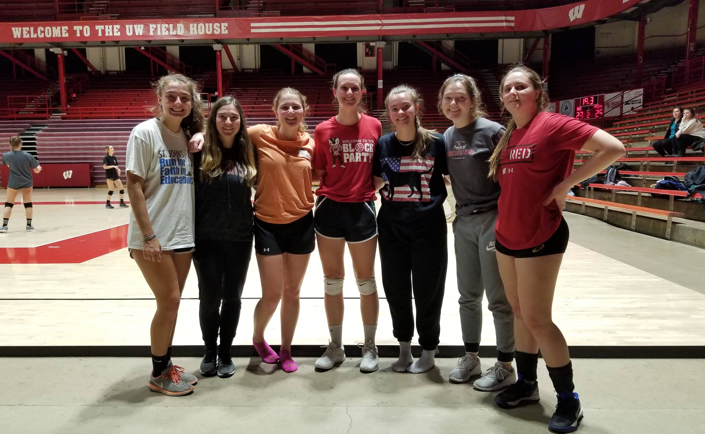

Despite my aura of radioactivity, I'm not *all* nuclear all the
time! I do other stuff too! Here are some of the ways I spend my free time...

# Dogs

## Fetch

I foster and dog-sit rescue dogs with
[Fetch Wisconsin Rescue](http://fetchwi.org). If you're interested, you can
support Fetch's mission by [donating here](https://www.fetchwi.org/donate).

### Bundy (June - July 2020)

Bundy is an adult Alaskan Malamute. He is almost 100 lbs of pure fluffy energy,
and became my training buddy as I got ready to hike the John Muir Trail. We
walked about 8-10 miles a day together in the Madison heat, which was barely
enough to keep his energy level down at home.

Likes: swimming in Lake Mendota

Dislikes: going without exercise for more than 2 hours, being called a husky 
(he's not a husky!)

#### Lucy (March - April 2020)

Lucy is a 4 month old black mouth cur--coonhound mix. It's important to her
that she has access to multiple toys, which she plays with consecutively 
because she gets bored after a few minutes of one.

Likes: Kongs of food and falling asleep on my lap

Dislikes: going outside.

#### Rambler (Dec 2019 - June 2020)

Rambler is a 4.5 year old who is calm as cucumber and loyal beyond all. He
tested positive for heartworms not long after I got him, so I fostered him
throughout the entire (multi-month) recovery process. He is the sweetest,
gentlest dog I'd ever met, and my whole family fell in love with him. He was
adopted by one of my aunts down in St. Louis, MO.

Likes: being in the same room as people, staring at Katie, and sleeping

Dislikes: playing with toys on his own

#### Jolene (Oct 2019)

Jolene is a hound mix (part beagle maybe?) and is 35 pounds of cuddle-bug. She
was picked up as a stray in Texas and saved less than an hour before she was
scheduled to be euthanized :(

Jolene was estimated to be about a year old, but her puppy energy made me 
suspect she was even younger than that.

She loves couches, hates cars, and her puppy-dog eyes are extremely dangerous.
Good girl Jolene!

#### Monica (2019)

My first foster dog, Monica, has been adopted! She is a three year old (at the
  time I had her) lab mix with separation anxiety but a huge heart.

#### Dog sitting

While I usually foster dogs until they find their furever home, sometimes I
dog-sit for shorter periods of time, usually when a foster is out of town.

## Sled Dogs

I'm a volunteer dog handler at sled dog races! I have no plans to race dogs
myself, but I love to support the athletes (dog and human alike)! Look for me at
many of the races in the upper midwest this winter!

If you're interested in learning more about doggo-powered sports or just want to
see some cool dogs pics, consider following musher
[Blair Braverman](https://twitter.com/BlairBraverman?ref_src=twsrc%5Egoogle%7Ctwcamp%5Eserp%7Ctwgr%5Eauthor)
! It was her tweets and her book, [Welcome to the Goddamn Ice Cube](https://www.harpercollins.com/9780062311580/welcome-to-the-goddamn-ice-cube/)
that got me into the sport!

## Baja SAE

I spent two years on the UW-Madison [Baja SAE](https://www.bajasae.net/)
automotive team.

## Volleyball

I've been playing volleyball for more than a decade, despite my short stature.
 Several back injuries stopped me from playing competitively at the end of
 high school and early in college, but I eventually picked it back up at the
 recreational level. In 2019 I sustained a concussion playing in the
 semifinals of the coed intramural league as a substitute player. Whoops!

## Outdoorsy things

I try to spend my free time hiking, camping, skiing, and mountain biking when
I can. Here are some of my favorite recent trips

- John Muir Trail, CA (July-August 2020)
- Porcupine Mountains, MI (Jan 2020)
- Sleeping Giant Provinical Park, Ontario and Grand Marais, MN (Sept 2019)
- Silverton, CO (July 2018)